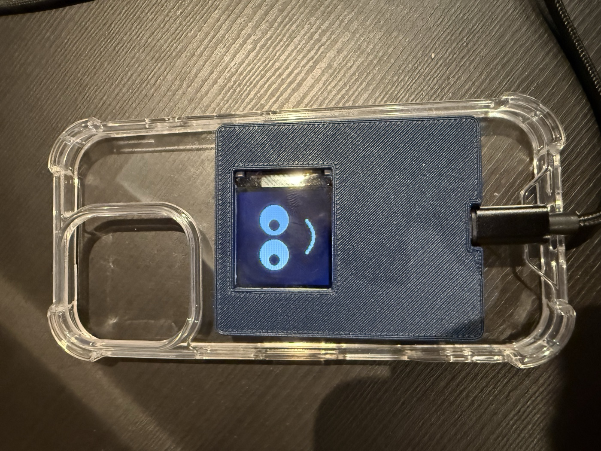
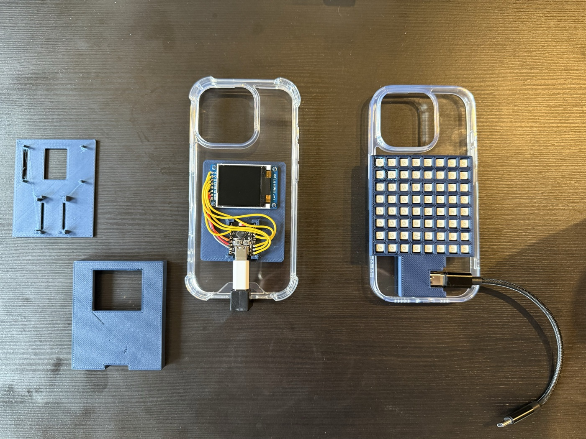
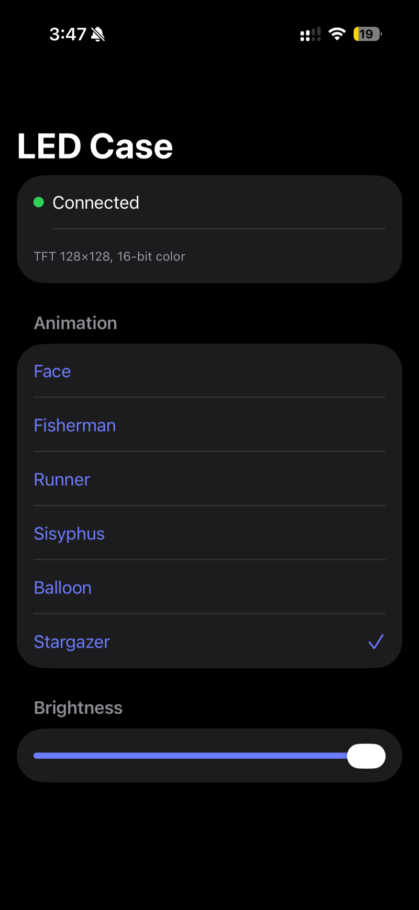
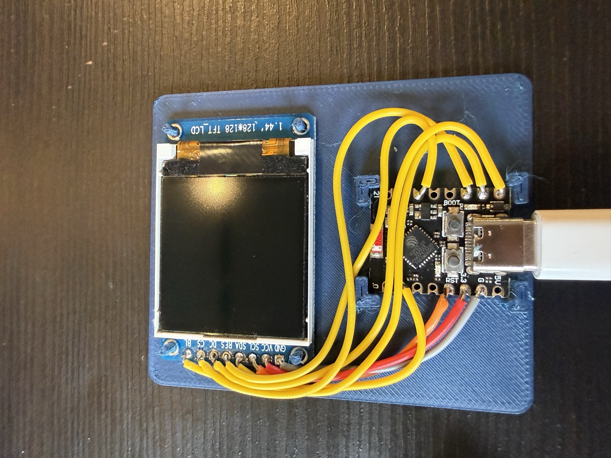

# LED Phone Case

A clear iPhone 16 Pro case with a small display on the back. An ESP32-C3 drives built-in animations; a companion iOS app selects them over Bluetooth. Powered by the phone's USB-C port, no battery.



## Two prototypes

| | |
|---|---|
| **Case A** | 1.44" 128×128 color TFT (ST7735) |
| **Case B** | 8×8 WS2812 LED matrix |

Both run the same firmware core and the same app. The device reports its display type over BLE and the app adapts.



## Animations

Six built-in, all drawn procedurally at runtime:

1. **Face** — eyes that look around, blink, and change expression
2. **Fisherman** — a rower poling his boat across moonlit water
3. **Runner** — a stick figure running laps around the screen edge, pausing to look around
4. **Sisyphus** — pushes his boulder around the screen edge; it always rolls back
5. **Balloon** — a kid chasing a balloon he never catches
6. **Stargazer** — two figures on a hill under a twinkling sky with shooting stars

## App

SwiftUI + CoreBluetooth. Connects automatically, lists the animations the case reports, sets brightness.



## Parts (Case A)

- ESP32-C3 SuperMini
- 1.44" TFT LCD, 128×128, SPI (M029 module)
- Clear TPU case
- 3D-printed carrier plate and cover
- USB-C cable to the phone



Case B swaps the TFT for an 8×8 WS2812 matrix plus a 74HCT04 level shifter, 330 Ω data resistor, and 1000 µF capacitor. Full wiring, pin map, power budget, and BLE protocol: [DESIGN.md](DESIGN.md).

## Build

Firmware (PlatformIO):

```
cd firmware
pio run -t upload
```

App: open `app/LEDCase.swiftpm` in Xcode and run it on an iPhone.
