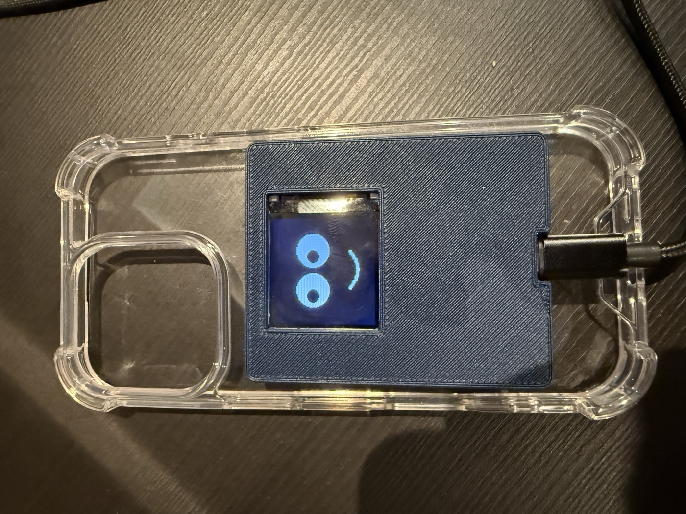
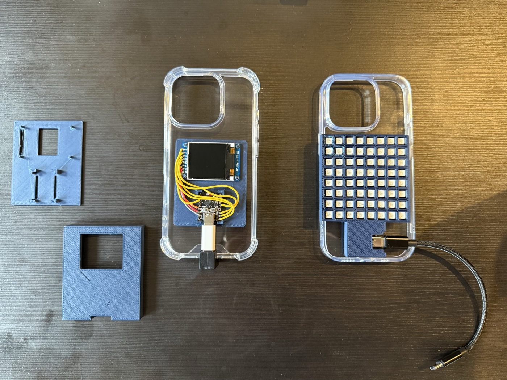
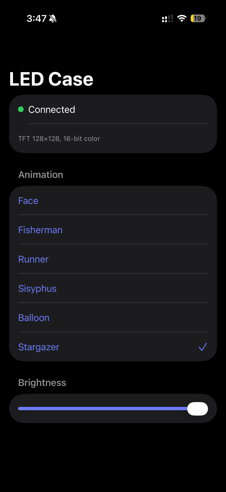
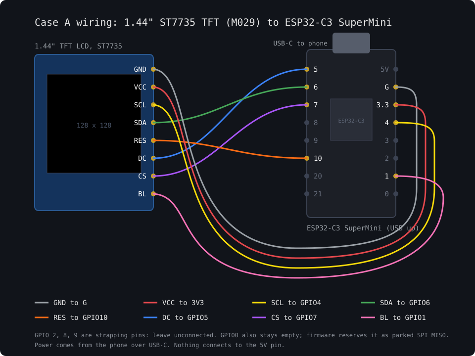
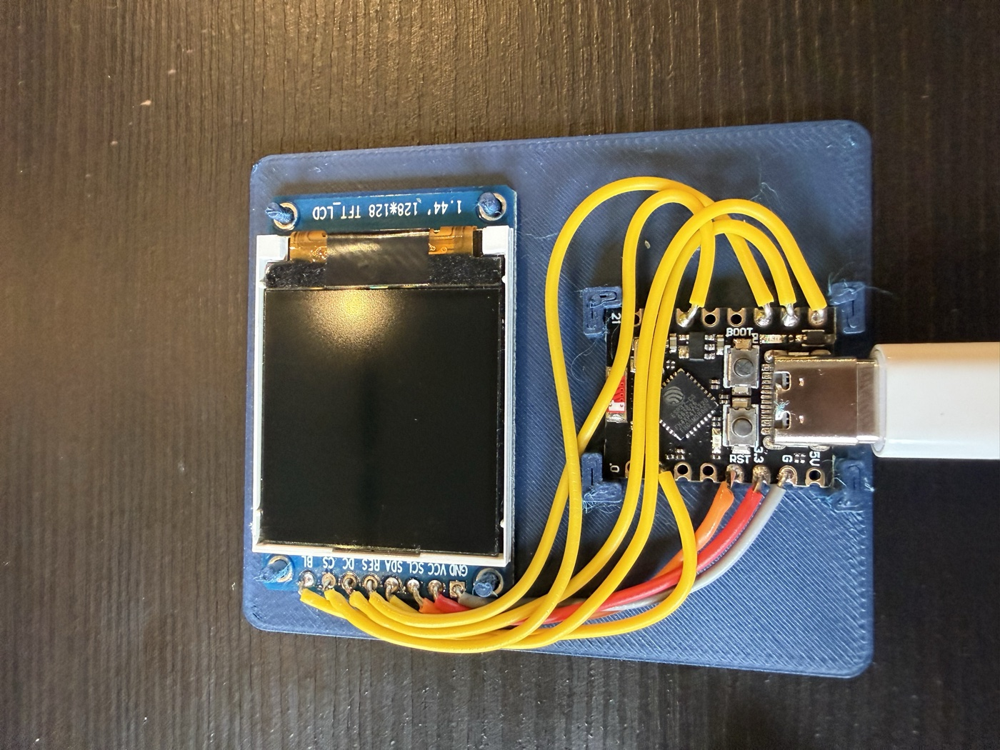

# LED Phone Case

A clear iPhone 16 Pro case with a small display on the back. An ESP32-C3 drives built-in animations; a companion iOS app selects them over Bluetooth. Powered by the phone's USB-C port, no battery.



## Two prototypes

| | |
|---|---|
| **Case A** | 1.44" 128×128 color TFT (ST7735) |
| **Case B** | 8×8 WS2812 LED matrix |

Both run the same firmware core and the same app. The device reports its display type over BLE and the app adapts.



## Animations

Fifteen built-in, all drawn procedurally at runtime. Nine scene animations:

1. **Face** — eyes that look around, blink, and change expression
2. **Fisherman** — a rower poling his boat across moonlit water
3. **Runner** — a stick figure running laps around the screen edge, pausing to look around
4. **Sisyphus** — pushes his boulder around the screen edge; it always rolls back
5. **Balloon** — a kid chasing a balloon he never catches
6. **Stargazer** — two figures on a hill under a twinkling sky with shooting stars
7. **Campfire** — two figures around a flickering fire under the night sky
8. **Owl** — an owl on a branch scanning for the mouse that crosses below
9. **Juggler** — a stick figure juggling a three-ball cascade

Six low-res animations designed on an 8×8 grid, native to the LED matrix (chunky pixel art on the TFT):

10. **Rainbow** — a color wave sweeping the grid
11. **Fire** — rising-flame heat simulation
12. **Rain** — drops falling at different speeds with fading trails
13. **Heart** — pixel heart with a lub-dub pulse
14. **Snake** — the game, playing itself
15. **Smiley** — big pixel face cycling expressions: smiles, winks, surprise

## App

SwiftUI + CoreBluetooth. Connects automatically, lists the animations the case reports grouped by resolution, sets brightness and playback speed.



## Bill of materials (Case A)

The simplest build. Generic modules; any equivalent listing works.

| Part | Qty | Notes |
|---|---|---|
| [ESP32-C3 SuperMini](https://www.amazon.com/AITRIP-ESP32-C3-Development-Supermini-Expansion/dp/B0FBG9N7M3) | 1 | Any ESP32-C3 SuperMini board |
| [1.44" TFT LCD, 128×128, SPI, ST7735](https://www.amazon.com/HiLetgo-Colorful-Display-128X128-Replace/dp/B073R6SQRY) | 1 | 8-pin module (sold as M029 on AliExpress) |
| [Clear TPU case, iPhone 16 Pro](https://www.amazon.com/TORRAS-iPhone-16-Pro-Non-Yellowing/dp/B0D9BGSGFR) | 1 | Soft/flexible, not polycarbonate |
| [Short USB-C to USB-C cable](https://www.amazon.com/MCSPER-Short-USB-Cable/dp/B0D4VKQ62B) | 1 | 15-20 cm, phone to board |
| 3D-printed carrier plate and cover | 1 | Any PLA or PETG |
| Thin hookup wire | ~8 leads | Display to board, ~30 AWG |

## Wiring (Case A)





Case B swaps the TFT for an 8×8 WS2812 matrix plus a 74HCT04 level shifter, 330 Ω data resistor, and 1000 µF capacitor. Full wiring, pin map, power budget, and BLE protocol: [DESIGN.md](DESIGN.md).

## Build

Firmware (PlatformIO), one environment per case:

```
cd firmware
pio run -e case-a-tft -t upload
pio run -e case-b-matrix -t upload
```

App: open `app/LEDCase.swiftpm` in Xcode and run it on an iPhone.

## Browser emulator

Preview the **128×128** scene animations in a web browser without hardware.
The emulator compiles `firmware/src/animations.cpp` to WebAssembly. See
[emulator/README.md](emulator/README.md).

```bash
cd emulator
./scripts/build-wasm.sh
python3 -m http.server 8080
```

Open http://localhost:8080
